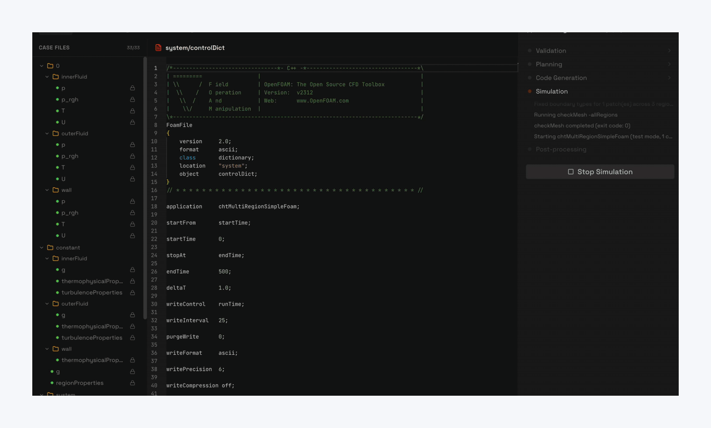
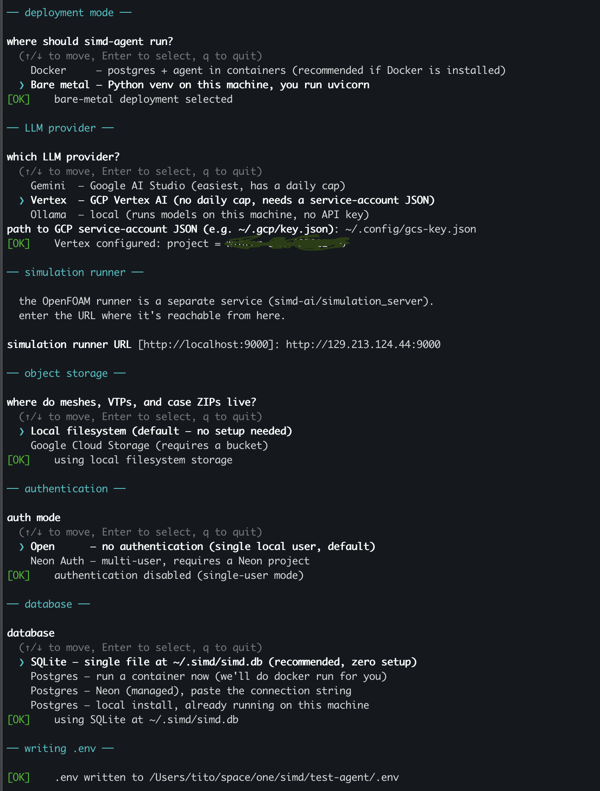

# SIMD Agent

AI-native physics simulation agent.

🎯 What it does
---------------

Describe the physics you want to understand — flow, heat transfer,
buoyancy, pressure drop, mixing — together with a mesh of the physical
domain, and the agent picks the governing equations and turbulence
model, configures discretization schemes, properties, and boundary
conditions, submits the case to an OpenFOAM solver, streams residuals
and flow fields back, and self-heals on solver failure. The result:
**design-decision support** — questions that usually take a CFD
specialist a week ("does this U-bend overheat at 500 K?", "what's the
pressure drop through the regasifier?") become a paragraph of intent
plus a geometry.

✨ Features
-----------

  - 🌊 **Natural-language input** — describe the physics you want to understand in plain English
  - 🧭 **Auto solver selection** — picks the right OpenFOAM solver from your prompt + mesh
  - 🩹 **Self-healing loop** — diagnoses solver failures and retries with focused fixes
  - 📡 **Live streaming** — residuals and 3D fields delivered live over WebSocket
  - 🧠 **Multi-LLM** — Gemini, Vertex AI, or local Ollama
  - 🔓 **Open source** — AGPL v3, run anywhere

🛠 Capabilities
---------------

| Feature                          | Description                                            |
|----------------------------------|--------------------------------------------------------|
| Compressible & incompressible    | [simpleFoam family + rhoSimple variants](Documentation/solvers/single-region) |
| Turbulence regimes               | k-ε, k-ω SST, k-ω, Spalart-Allmaras                    |
| Conjugate heat transfer          | [solid-fluid coupling (chtMultiRegion)](Documentation/solvers/multi-region-cht) |
| Multiphase flows                 | [VOF (experimental — interFoam family)](Documentation/solvers/multiphase) |
| LLM providers                    | [Gemini](Documentation/llm-providers/gemini) · [Vertex AI](Documentation/llm-providers/vertex) · [Ollama](Documentation/llm-providers/ollama) (local) |
| Object storage                   | local filesystem · Google Cloud Storage                |
| Authentication                   | Neon Auth · open (no auth)                             |

See [Documentation/solvers](Documentation/solvers) for the full list of supported solvers.

  

🚀 Quick start
--------------

The agent is one of three components — the other two live in their own
repos:

  - **simd-ai/agent** (this repo) — the orchestrator
  - **simd-ai/runner** — the OpenFOAM runner (separate process)
  - **simd-ai/ui** — the Next.js frontend (drive the agent)

You'll need:

  - Docker + Docker Compose, **or** Python 3.11+ for bare-metal mode
  - One LLM credential: a Gemini API key, OR a Vertex AI service-account
    JSON, OR a local Ollama install

Clone and run the installer:

    git clone https://github.com/simd-ai/agent
    cd agent
    ./install.sh

``install.sh`` is an interactive wizard that writes ``.env`` and either
brings up the stack (Docker mode) or sets up a venv (bare-metal mode).

<b>Preview the install wizard</b>

  

<b>Docker mode</b>

 

Brings up agent + postgres + frontend + OpenFOAM runner from a single
``docker compose`` file.  Once the wizard finishes, the agent is at
``http://localhost:8000`` and the frontend at ``http://localhost:3000``.
Everything stops with ``docker compose down``.

<b>Bare-metal mode</b>

 

Installs only the agent in a local Python venv.  The wizard prints the
``uvicorn`` command at the end.  You bring your own runner and (if you
want a UI) frontend:

    # OpenFOAM runner — clone & start separately
    git clone https://github.com/simd-ai/runner
    cd runner && ./run.sh
    # (or point ``SIMULATION_SERVER_URL`` at a remote one)

    # Frontend — clone & start separately (optional)
    git clone https://github.com/simd-ai/ui
    cd ui && npm install && npm run dev

Or skip the UI entirely and drive the agent through the WebSocket /
HTTP API at ``http://localhost:8000`` (see ``Documentation/api/``).

⚙️ How it works
---------------

A FastAPI service orchestrates per-file OpenFOAM codegen with an LLM,
validates the output with deterministic plugin-side rules, ships the
case to a service running OpenFOAM, and streams residuals and
post-processed VTK back through a WebSocket. When the solver fails,
the agent diagnoses the error with a smaller LLM call and retries
with focused fixes — up to seven attempts by default. This is the
self-healing loop.

See Documentation/architecture for the full design,
Documentation/self-healing for a walkthrough of one real failure.

🧪 Examples
-----------

Four end-to-end cases ship under `examples/`. Each carries its mesh,
its prompt, and the generated OpenFOAM case files — so you can run
the simulation directly with OpenFOAM, or watch the agent regenerate
it from the prompt.

| Case | Physics | Solver |
|---|---|---|
| [u-shape-pipe](Documentation/examples/u-shape-pipe) | compressible inverted-U duct | rhoSimpleFoam + kOmegaSST |
| [z-bend](Documentation/examples/z-bend) | transient turbulent water pipe | pimpleFoam + kOmegaSST |
| [inner-outer-pipe](Documentation/examples/inner-outer-pipe) | 2D LN2/water counter-flow regasifier | chtMultiRegionSimpleFoam |
| [cylindrical-cht](Documentation/examples/cylindrical-cht) | natural convection around a heated cylinder | buoyantBoussinesqSimpleFoam |

🗺 Roadmap
----------

See [ROADMAP](ROADMAP) for what's next and what's in the idea bin.
Tracking happens in GitHub Issues.

🤝 Contributing
---------------

See CONTRIBUTING. New solver plugins drop into
`simd_agent/solvers/<name>/` and are auto-discovered; new LLM
providers drop into `simd_agent/llm/<name>/`. No registry edits
needed.
