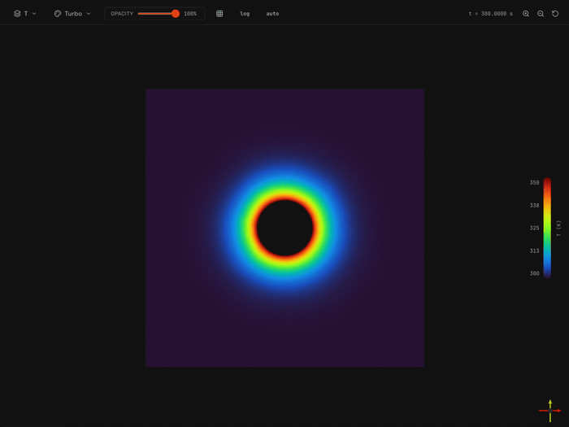

# SIMD Agent

AI-native physics simulation agent.

What it does
------------

Takes a **natural-language description of the physical phenomena you want
to understand** — flow regime, heat transfer, buoyancy, pressure drop,
mixing, conjugate heat transfer through solids — together with a
**mesh of the physical domain** you care about.

From those two inputs the agent picks the governing equations and
turbulence model that fit, configures the discretization schemes,
linear-solver settings, thermophysical and material properties, and
boundary conditions, submits the case to an OpenFOAM solver, streams
residuals and post-processed flow fields back as the run converges,
and self-heals on solver failure.

The intent is **design-decision support**. Questions that usually take a
CFD specialist a week to set up — "does this U-bend overheat at the
500 K inlet?", "what's the pressure drop through the regasifier?", "is
natural convection enough or do I need a forced inlet?" — become a
paragraph of intent plus a geometry.

### Physics

| Capability | Status |
|---|---|
| [Compressible & incompressible flow](Documentation/solvers/single-region) | stable |
| Laminar & turbulent regimes (k-ε, k-ω SST, k-ω, Spalart-Allmaras) | stable |
| [Conjugate heat transfer (solid-fluid)](Documentation/solvers/multi-region-cht) | stable |
| [Multiphase flows](Documentation/solvers/multiphase) | experimental |

See [Documentation/solvers](Documentation/solvers) for the full list of supported solvers.

### Infrastructure

| Integration | Options |
|---|---|
| LLM provider | [Gemini](Documentation/llm-providers/gemini) · [Vertex AI](Documentation/llm-providers/vertex) · [Ollama](Documentation/llm-providers/ollama) (local) |
| Object storage | local filesystem · Google Cloud Storage |
| Authentication | Neon Auth · open (no auth) |

What you need
-------------

  - Docker + Docker Compose
  - One LLM credential: a Gemini API key, OR a Vertex AI service-account
    JSON, OR a local Ollama install

That's it. The compose stack ships OpenFOAM v2406, Postgres, the
agent, and the frontend.

Quick start
-----------

    git clone https://github.com/simd-ai/agent
    cd agent
    ./install.sh

``install.sh`` is an interactive wizard.  Pick **Docker mode** to
run everything in containers (postgres + agent come up via
``docker compose``), or **bare-metal mode** to use a Python venv
on this machine.  Either way it asks for your LLM key, the
simulation runner URL, and where to store results — then writes
``.env``.  In Docker mode the stack starts automatically; in
bare-metal mode the wizard prints the ``uvicorn`` command to run.

Once the agent is up at ``http://localhost:8000``, drive it through
the WebSocket / HTTP API (see ``Documentation/api/``) or run the
frontend at ``http://localhost:3000``.

How it works
------------

A FastAPI service orchestrates per-file OpenFOAM codegen with an LLM,
validates the output with deterministic plugin-side rules, ships the
case to a sim-server running OpenFOAM, and streams residuals and
post-processed VTK back through a WebSocket. When the solver fails,
the agent diagnoses the error with a smaller LLM call and retries
with focused fixes — up to seven attempts by default. This is the
self-healing loop.

See Documentation/architecture for the full design,
Documentation/self-healing for a walkthrough of one real failure.

Examples
--------

Four end-to-end cases ship under `examples/`. Each carries its mesh,
its prompt, and the generated OpenFOAM case files — so you can run
the simulation directly with OpenFOAM, or watch the agent regenerate
it from the prompt.

    examples/u-shape-pipe/        compressible inverted-U duct,
                                  rhoSimpleFoam + kOmegaSST
    examples/z-bend/              transient turbulent water pipe,
                                  pimpleFoam + kOmegaSST
    examples/inner-outer-pipe/    2D LN2/water counter-flow
                                  regasifier, chtMultiRegionSimpleFoam
    examples/cylindrical-cht/     natural convection around a heated
                                  cylinder, buoyantBoussinesqSimpleFoam

Walk-throughs and screenshots in Documentation/examples/.

Documentation
-------------

See Documentation/ for installation, deployment, the WebSocket
protocol, the solver plugin contract, and the LLM provider plugin
contract.

Contributing
------------

See CONTRIBUTING. New solver plugins drop into
`simd_agent/solvers/<name>/` and are auto-discovered; new LLM
providers drop into `simd_agent/llm/<name>/`. No registry edits
needed.

License
-------

Apache 2.0 — see LICENSE.

Acknowledgements
----------------

OpenFOAM® is a registered trade mark of OpenCFD Ltd. This project is
not approved or endorsed by OpenCFD or the OpenFOAM Foundation.
